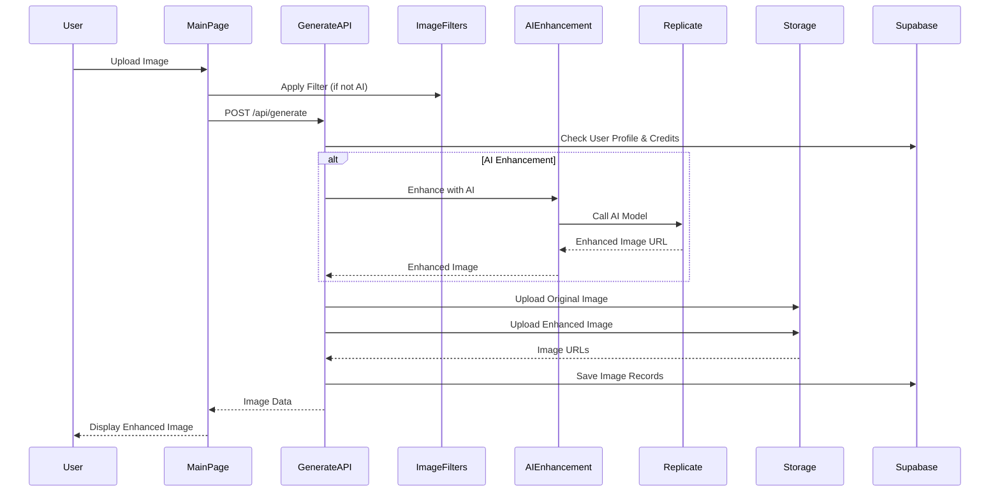
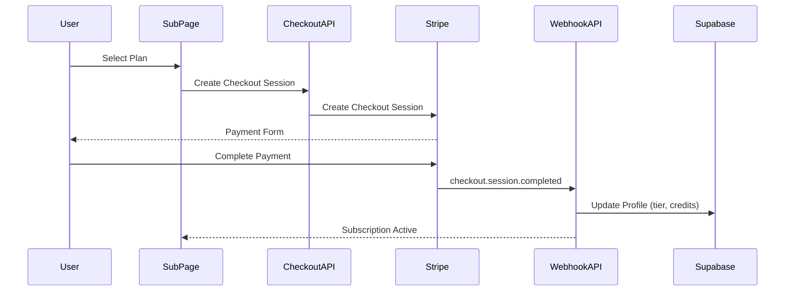

# Image Enhancer - System Architecture

## Architecture Diagram

```mermaid
graph TB
    subgraph "Client Layer"
        Browser[Browser/User]
        MainPage[Main Page<br/>app/page.tsx]
        SubPage[Subscriptions Page<br/>app/subscriptions/page.tsx]
        InfoPage[Info Page<br/>app/info/page.tsx]
        SignIn[Sign In Page<br/>app/sign-in]
        SignUp[Sign Up Page<br/>app/sign-up]
    end

    subgraph "Next.js Application"
        Middleware[Middleware<br/>Authentication & Routing]
        Layout[Root Layout<br/>app/layout.tsx]
        
        subgraph "API Routes"
            GenerateAPI[/api/generate<br/>Image Processing]
            ImagesAPI[/api/images<br/>Image Management]
            ProfileAPI[/api/profile<br/>User Profile]
            SubscriptionsAPI[/api/subscriptions<br/>Subscription Management]
            CheckoutAPI[/api/stripe/checkout<br/>Payment Checkout]
            WebhookAPI[/api/stripe/webhook<br/>Stripe Events]
            CleanupAPI[/api/cleanup<br/>Image Cleanup]
        end
        
        subgraph "Components"
            EmojiCard[EmojiCard<br/>Image Display]
            ImageCropper[ImageCropper<br/>Image Editing]
            ExampleGallery[ExampleGallery<br/>AI Model Examples]
        end
        
        subgraph "Libraries"
            ImageFilters[imageFilters.ts<br/>Client-side Filters]
            AIEnhancement[aiEnhancement.ts<br/>AI Integration]
            Storage[storage.ts<br/>File Management]
            SupabaseLib[supabase.ts<br/>Database Client]
        end
    end

    subgraph "External Services"
        Clerk[Clerk<br/>Authentication]
        Stripe[Stripe<br/>Payments & Subscriptions]
        Supabase[(Supabase<br/>Database & Storage)]
        Replicate[Replicate<br/>AI Models]
    end

    subgraph "Supabase Database"
        ProfilesTable[(profiles<br/>user_id, tier, credits,<br/>stripe_customer_id,<br/>stripe_subscription_id)]
        ImagesTable[(images<br/>user_id, original_url,<br/>enhanced_url, prompt)]
    end

    subgraph "Supabase Storage"
        ImageBucket[(image bucket<br/>user_id/filename)]
    end

    Browser --> MainPage
    Browser --> SubPage
    Browser --> InfoPage
    Browser --> SignIn
    Browser --> SignUp
    
    MainPage --> GenerateAPI
    MainPage --> ProfileAPI
    MainPage --> ImagesAPI
    MainPage --> EmojiCard
    MainPage --> ImageCropper
    MainPage --> ImageFilters
    
    SubPage --> SubscriptionsAPI
    SubPage --> CheckoutAPI
    
    InfoPage --> ExampleGallery
    
    Middleware --> Clerk
    SignIn --> Clerk
    SignUp --> Clerk
    
    GenerateAPI --> SupabaseLib
    GenerateAPI --> Storage
    GenerateAPI --> AIEnhancement
    GenerateAPI --> Replicate
    
    ImagesAPI --> SupabaseLib
    ImagesAPI --> Storage
    
    ProfileAPI --> SupabaseLib
    
    SubscriptionsAPI --> SupabaseLib
    SubscriptionsAPI --> Stripe
    
    CheckoutAPI --> SupabaseLib
    CheckoutAPI --> Stripe
    
    WebhookAPI --> Stripe
    WebhookAPI --> SupabaseLib
    
    CleanupAPI --> SupabaseLib
    CleanupAPI --> Storage
    
    AIEnhancement --> Replicate
    
    Storage --> ImageBucket
    SupabaseLib --> ProfilesTable
    SupabaseLib --> ImagesTable
    SupabaseLib --> ImageBucket
    
    Stripe -.Webhook Events.-> WebhookAPI
    Stripe -.Payment Status.-> SubscriptionsAPI
```

## Data Flow

### Image Enhancement Flow


### Subscription Flow


## Technology Stack

### Frontend
- **Framework:** Next.js 15.5.6 (App Router)
- **UI Library:** React 19.1.0
- **Styling:** Tailwind CSS 4
- **Components:** Radix UI, Lucide Icons
- **Image Processing:** react-easy-crop

### Backend
- **Runtime:** Node.js (Vercel Serverless Functions)
- **API:** Next.js API Routes
- **Authentication:** Clerk
- **Database:** Supabase (PostgreSQL)
- **Storage:** Supabase Storage
- **Payments:** Stripe
- **AI Services:** Replicate

### Infrastructure
- **Hosting:** Vercel
- **Cron Jobs:** Vercel Cron (daily cleanup)
- **Environment:** Development & Production

## Database Schema

### profiles Table
```sql
- user_id (PK, string) - Clerk user ID
- tier (enum) - 'free' | 'weekly' | 'monthly' | 'yearly' | 'premier_weekly' | 'premier_monthly' | 'premier_yearly'
- credits (number) - Filter enhancement credits
- ai_credits (number) - AI enhancement credits
- stripe_customer_id (string, nullable)
- stripe_subscription_id (string, nullable)
- cancel_at_period_end (boolean)
- created_at (timestamp)
- updated_at (timestamp)
```

### images Table
```sql
- id (PK, uuid)
- user_id (FK, string) - References profiles.user_id
- original_url (string) - Supabase Storage URL
- enhanced_url (string) - Supabase Storage URL
- prompt (string) - Enhancement method used
- likes (number)
- created_at (timestamp)
```

## Key Features

1. **Guest Access:** 20 free images without sign-up
2. **Authentication:** Clerk-based auth with sign-in/sign-up
3. **Image Processing:**
   - Client-side filters (Enhance, Vibrant, Cool, Warm, B&W)
   - AI enhancement via Replicate (GFPGAN, CodeFormer, Real-ESRGAN, etc.)
4. **Subscription Tiers:**
   - Free: 20 credits
   - Basic Plans: Weekly ($2.99), Monthly ($5.99), Yearly ($14.99)
   - Premier Plans: Weekly ($6.99, 100 AI), Monthly ($14.99, 200 AI), Yearly ($79, 800 AI)
5. **Storage:** Images stored in Supabase Storage, auto-deleted after 24 hours
6. **Payments:** Stripe integration for subscriptions and checkout

## Security

- **Authentication:** Clerk middleware protects routes
- **Authorization:** User-specific data access via Supabase RLS
- **API Security:** Service role key for admin operations only
- **Storage:** Private bucket with user-specific paths

## Deployment

- **Platform:** Vercel
- **Build:** Next.js production build
- **Environment Variables:** Configured in Vercel dashboard
- **Cron Jobs:** Daily cleanup at 2 AM (Vercel Hobby plan limit)


